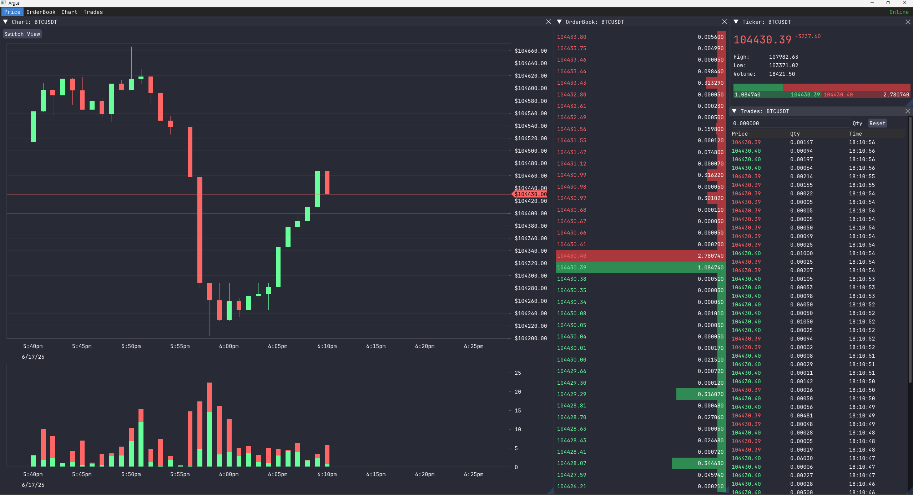

# Argus
- Cryptocurrency viewer
- Connects to the Kraken exchange and displays various info such as the orderbook, trades, price chart, etc.
- Uses ImGui to draw eveything to the screen with a glfw and OpenGL backend
- Uses ImPlot for the chart widget
- Use Boost Beast websockets to connect to the Kraken exchange
- Argus is a dog in Greek Mythology with 100 eyes (cause you're watching all the crypto prices. very creative)

- None of these widgets have connected to the exchange yet and are just displaying dummy data right now

# Compiling
- This program is designed to run on windows
- ImGui and ImPlot are submodules so you need to clone recursively
- To download run `git clone --recursive git@github.com:josephwehby/Argus.git`
